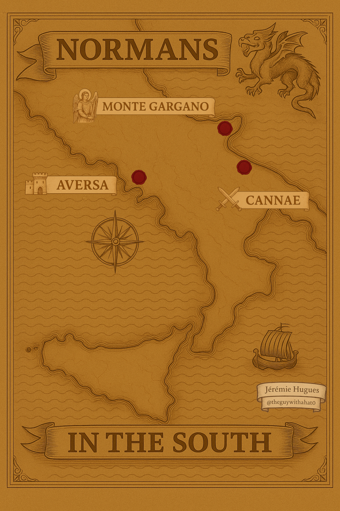

# 🎤 Welcome to My Lyrics Repository

🎸 Here, I share lyrics I’ve written — mostly rock/metal, mostly historical, and mostly about the Normans.

🤖 I work with AI tools (Suno for music, and ChatGPT for co-writing), but in the end, about 80% of the lyrics are mine, shaped by my voice and vision.

📝 All lyrics and songs in this repo are published under a Creative Commons license.

📂 You're free to use, adapt, or build upon them — just credit me if you do. That would be much appreciated.

## ⚔️ Normans in the South – A Metal EP in Three Episodes 

🔗 https://suno.com/playlist/8fab0895-2741-4806-8241-46c52952045b

   
  <em>Normans in the South</em>

In the early 11th century, a band of restless warriors crossed the sea, lured by the clash of empires and the promise of land. These were the Normans — mercenaries, pilgrims, adventurers — and southern Italy would never be the same.

Normans in the South is the first chapter in a growing medieval rock/metal saga.
This debut EP follows the dramatic rise of the Normans in Italy through thunderous riffs and battle-scarred verses:

    Monte Gargano – The first encounter. A Lombard rebellion brews in Apulia, and Norman pilgrims are drawn into the fight.
    🔗 https://suno.com/song/04b6ce0c-f776-4555-b8db-24edf10e23cf?sh=DU1Kmhq1oRqhcXzA

    Cannae – The crushing defeat. Byzantines retaliate with fury, and the Norman dream falters in blood and dust.
    🔗 https://suno.com/song/f1af0c51-93bc-4406-b14c-e3df9946788d?sh=axmNH95IkfAZjZgC

    Aversa – The first foothold. Rainulf Drengot is made count, and a new Norman rise begins.
    🔗 https://suno.com/song/f1af0c51-93bc-4406-b14c-e3df9946788d?sh=axmNH95IkfAZjZgC

More EPs are coming, chronicling the age of the Hautevilles, the conquest of Sicily, and beyond.
Follow along as I turn one of history’s wildest tales into a metal saga.
