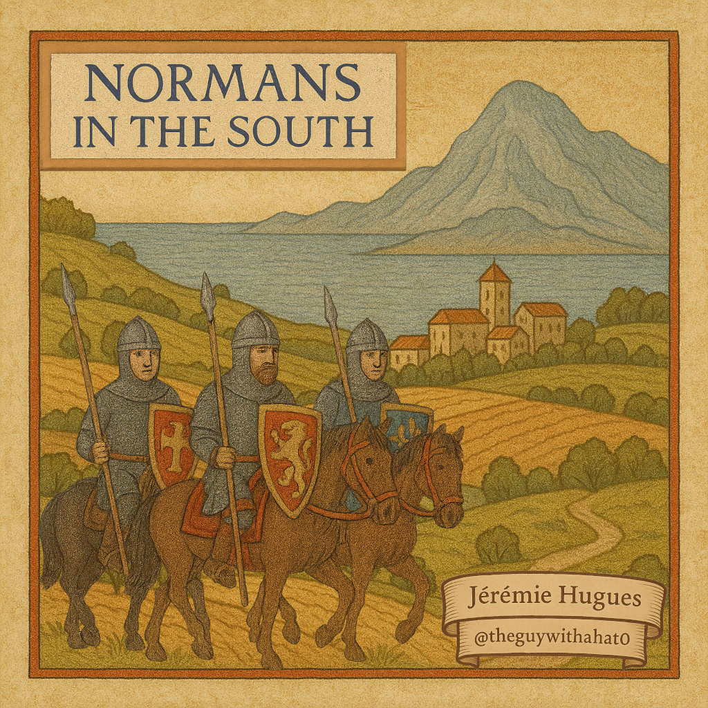
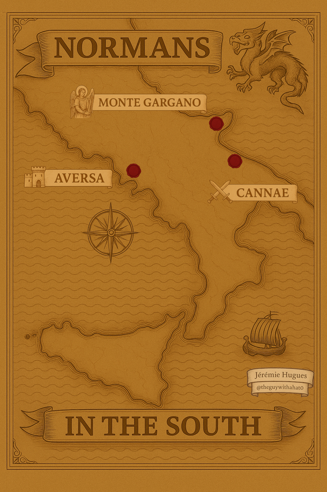

# 🎤 Welcome to My Lyrics Repository

🎸 Here, I share lyrics I’ve written — mostly rock/metal, mostly historical, and mostly about the Normans.

🤖 I work with AI tools (Suno for music, and ChatGPT for co-writing), but in the end, the lyrics are mine.

📝 This work is licensed under [CC BY-SA 4.0](https://creativecommons.org/licenses/by-sa/4.0/)

📂 You're free to use, adapt, or build upon them — just credit me if you do. That would be much appreciated.

## ⚔️ Normans in the South – A Metal EP in Three Episodes 

🎧 [Listen on Suno](https://suno.com/playlist/8fab0895-2741-4806-8241-46c52952045b)

   
  <em>Normans in the South</em>

In the early 11th century, a band of restless warriors crossed the sea, lured by the clash of empires and the promise of land. These were the Normans — mercenaries, pilgrims, adventurers — and southern Italy would never be the same.

**Normans in the South** is the first chapter in a growing medieval rock/metal saga.  
This debut EP follows the dramatic rise of the Normans in Italy through thunderous riffs and battle-scarred verses:

- **Monte Gargano** – *The first encounter.* A Lombard rebellion brews in Apulia, and Norman pilgrims are drawn into the fight.  
  🎧 [Listen on Suno](https://suno.com/song/04b6ce0c-f776-4555-b8db-24edf10e23cf?sh=DU1Kmhq1oRqhcXzA)

- **Cannae** – *The crushing defeat.* Byzantines retaliate with fury, and the Norman dream falters in blood and dust.  
  🎧 [Listen on Suno](https://suno.com/song/f1af0c51-93bc-4406-b14c-e3df9946788d?sh=axmNH95IkfAZjZgC)

- **Aversa** – *The first foothold.* Rainulf Drengot is made count, and a new Norman rise begins.  
  🎧 [Listen on Suno](https://suno.com/song/f1af0c51-93bc-4406-b14c-e3df9946788d?sh=axmNH95IkfAZjZgC)

   
  <em>Map</em>

🛡️ More EPs are coming, chronicling the age of the Hautevilles, the conquest of Sicily, and beyond.  
Follow along as I turn one of history’s wildest tales into a metal saga.
