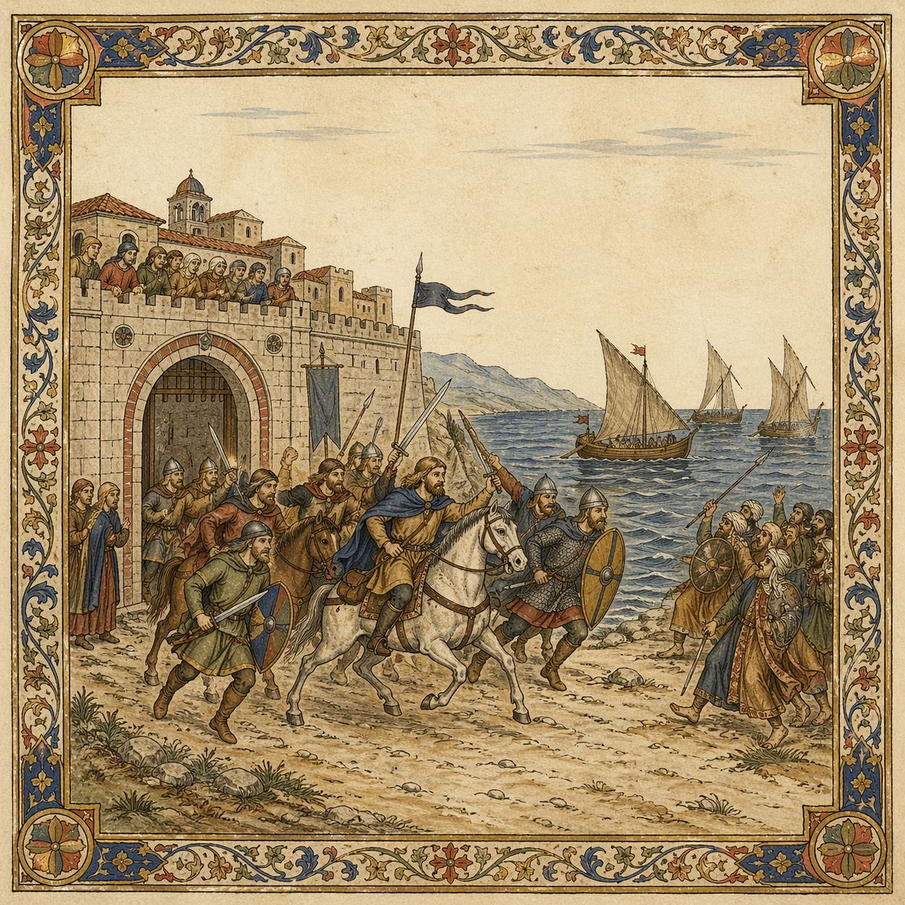

# Salerno

> **Historical context:** A group of Norman pilgrims returning from Jerusalem reaches Salerno, where Saracen raiders threaten the city. In the legend, the Normans reject tribute, take up arms, and show southern Italy the value of Norman steel.

[Verse 1]
Weary pilgrims, Norman men,
Yearning to see home again,
Back from far Jerusalem,
Salerno, last stop for them.
Seat of Lombard princely pride,
Merchants sailed from far and wide.
Towers rose above the bay,
Porters cried along the quay.

[Pre-Chorus]
On the horizon, Saracen sails,
They come to plunder and defile.

[Chorus]
Drive them back! Stand and fight!
In the name of Jesus Christ!
Break their ranks and let us ride,
Cast them back into the tide!
Drive them back! Hold the line!
Saracen blood reddens the brine!

[Verse 2]
Saracens landed ashore,
To defile and plunder more.
In the square the silver laid,
Tribute still had to be paid.
What a cowardly display,
Normans mocked such craven ways.
Drew their swords ready to kill,
Tribute shall be paid with steel!

[Pre-Chorus 2]
Out through the gates the Normans charged,
To strike the Saracens down!

[Chorus]
Drive them back! Stand and fight!
In the name of Jesus Christ!
Break their ranks and let us ride,
Cast them back into the tide!
Drive them back! Hold the line!
Saracen blood reddens the brine!

[Verse 3]
Norman riders charged ahead,
Struck the Mahometans dead.
No tribute would be paid that day,
Only blood would flood the bay.
On the shore two worlds collide,
Still the Norman warriors ride!
Unleashing holy fury,
Riding on to victory!

[Bridge]
Prince Guaimar offered them gold,
Silver, thanks, and words of praise.
Normans would take no reward,
Swear no oaths of fealty,
Northward then they rode away,
Told their tale to kin and friend.
Norman knights would soon ride south,
For coin, for glory, and for land.

[Final Chorus]
Drive them back! Stand and fight!
In the name of Jesus Christ!
Break their ranks and let us ride,
Cast them back into the tide!
Drive them back! Hold the line!
Thus began the Norman tide!

[Outro]
From Salerno word was borne,
Southward came the Norman storm.
No more pilgrims, men of war,
A new age of conquerors!
