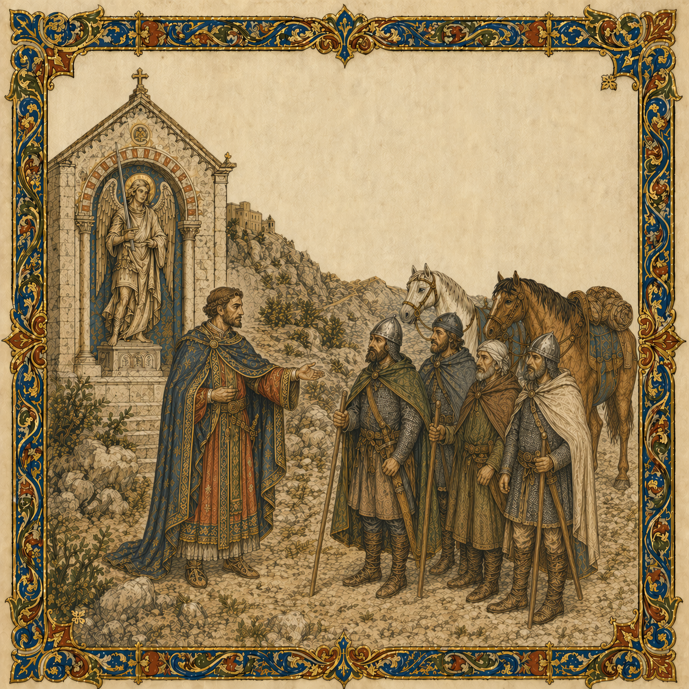

# Monte Gargano

> **Historical context:** At the shrine of Saint Michael on Monte Gargano, the Lombard rebel Melus of Bari meets Norman pilgrims returning from the Holy Land. His appeal draws the Normans toward the wars of southern Italy.

[Intro]
Hail good pilgrims, well met indeed,
I seek your help, I am in need.

[Verse 1]
I am Melus, lord of Bari,
The Greek still holds my rightful city.
To this mount I came to pray,
Before the shrine at break of day.
From foreign lands an emperor,
Took my realm, but not my honor.

[Verse 2]
We came to pray, not draw the blade,
Men under God, but battle-made.
We fly no flag, we serve no throne,
We bend no knee, we stand alone.
We’ve made no vow, come from afar,
Why should we fight another’s war?

[Chorus 1]
Ride with me, and take your stand,
By Saint Michael blessed, amen.
Heed my call, ye Norman men,
Bring forth a new age for my land.

[Verse 3]
The Emperor strips bare our fields,
Takes from our homes and fills his hoard.
These men from Greece take us for fools,
They preach of peace, yet wield the sword.
We call for men who will not yield,
To join us on the battlefield.

[Verse 4]
We bow to no lord, we are free,
We owe no oath, no fealty.
And like our steeds we won't be tamed,
Why should we wage war in your name?
We may return, if terms ring true,
And honor awaits those who do.

[Bridge]
Saint Michael, knight of heaven’s host,
Without these men my cause is lost.
Guide them home across the land,
Then lead them back with sword in hand.

[Chorus 2]
Ride with me, let swords be drawn,
In the name of Saint Michael.
Raise your banners, heed my call,
Bring to this land a new dawn!

[Outro]
They rode away, to home and kin,
Their souls washed clean from all their sin.
But then returned, their banners raised,
They would come to the Lombard's aid.

[Finale]
Brave knights, bold sons from Normandy,
Will make their mark in history!
