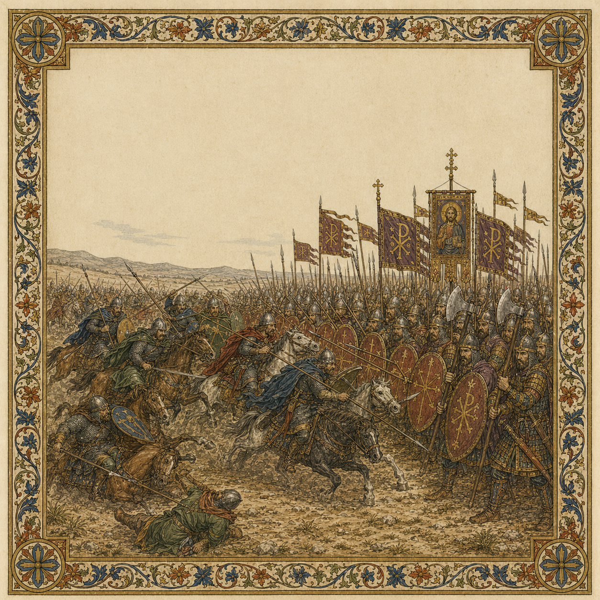

# Cannae

> **Historical context:** In 1018, Melus and his Lombard-Norman allies met the Byzantine catapan Basil Boioannes near Cannae. The rebels were crushed, but the battle did not end the Norman story in Italy.

[Intro]
Who dares defy an Empire,
Must face the greatest might on earth,
Hannibal’s deeds may inspire,
Yet Cannae is a place of death.

[Verse 1]
When Melus, prince of Lombard pride,
Called Norman blades to fight beside,
On sacred ground an oath was sworn,
A fateful alliance there was born.
They took to battle side by side,
Ravaged Apulia far and wide.

[Chorus]
And there they fell, on Cannae’s field,
They rose, they fought, and did not yield.
The Norman charge broken and crushed,
The Empire’s rule restored.

[Verse 2]
Basil Boioannes marched forth,
The catapan would prove his worth.
Two mighty hosts drew up that day,
They met where ancient legions lay.
The Normans' charge was fierce and brave,
Varangians became their grave.

[Chorus]
And there they fell, on Cannae’s field,
They rose, they fought, and did not yield.
The Norman charge broken and crushed,
The Empire’s rule restored.

[Verse 3]
The Lombards’ hopes were swept away,
And with their lives they had to pay.
Norman pride and bravery,
Fell to Varangian fury.
The Empire answered with might,
To uphold its ancient right.

[Bridge]
A battle lost, a great defeat,
The rebels forced into retreat.
The catapan stood proud that day,
Still fate would have the final say.

[Chorus]
And there they fell, on Cannae’s field,
They rose, they fought, and did not yield.
The Norman charge broken and crushed,
The Empire’s rule restored.

[Outro]
The Normans were routed and slain,
Their banners torn, not in vain.
More would ride south with bold intent,
And with their wars brought great lament.

[Ghost Chorus]
And there they fell, on Cannae’s field,
They rose, they fought, and did not yield.
The Norman charge broken and crushed,
The Empire’s rule restored.
