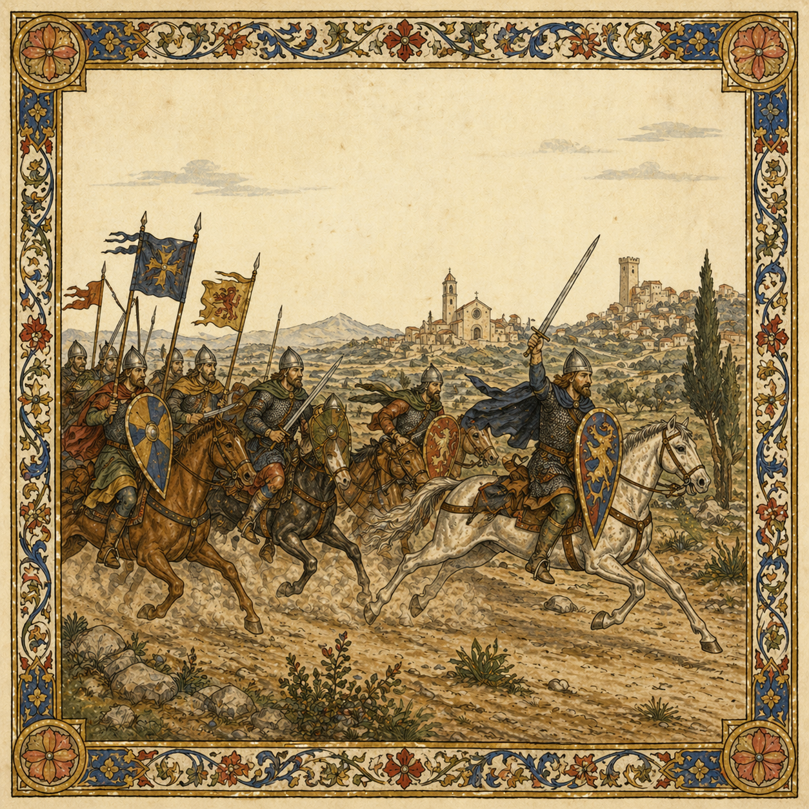

# Campania

> **Historical context:** After the first Norman interventions in southern Italy, their reputation as mounted warriors spread. Lombards, Greeks, princes, popes, and emperors all learned that Norman swords could be hired — and that mercenaries might one day become masters.

[Intro]

[Verse 1]
Drawn by tales of heavenly lands,
Norman men assembled in bands.
Riding far from Normandy,
Southward bound to Italy.
A rich, sweet land laid waste by war,
Where those who dare could earn far more.

[Chorus]
Norman swords are for sale,
Across Campania,
Have you heard of their tale?
Pay them to fight your wars.
Your coin deserves the best,
And their greed will never rest.

[Verse 2]
The nobles sought their sword and lance,
And paid in silver for the chance.
Called to the south by prince and pope,
They gave ambitious lords new hope.
Lombards, Greeks, counts, emperors,
Would spend good coin on warriors.

[Chorus]
Norman swords are for sale,
Across Campania,
Have you heard of their tale?
Pay them to fight your wars.
Your coin deserves the best,
And their greed will never rest.

[Verse 3]
Rode to war across Apulia,
From Bari’s fields to Capua.
With every battle earned their pay,
Each victory would pave their way.
Who goes to war in Italy,
Pays warriors from Normandy.

[Bridge]
Men of war, men of carnage,
Would usher in a Norman age.
Silver, gold and praise they earned,
But for their own lands they yearned.

[Final Chorus]
Norman swords are for sale,
Across Campania,
Have you heard of their tale?
Pay them to fight your wars.
Your coin deserves the best,
And their greed will never rest.
