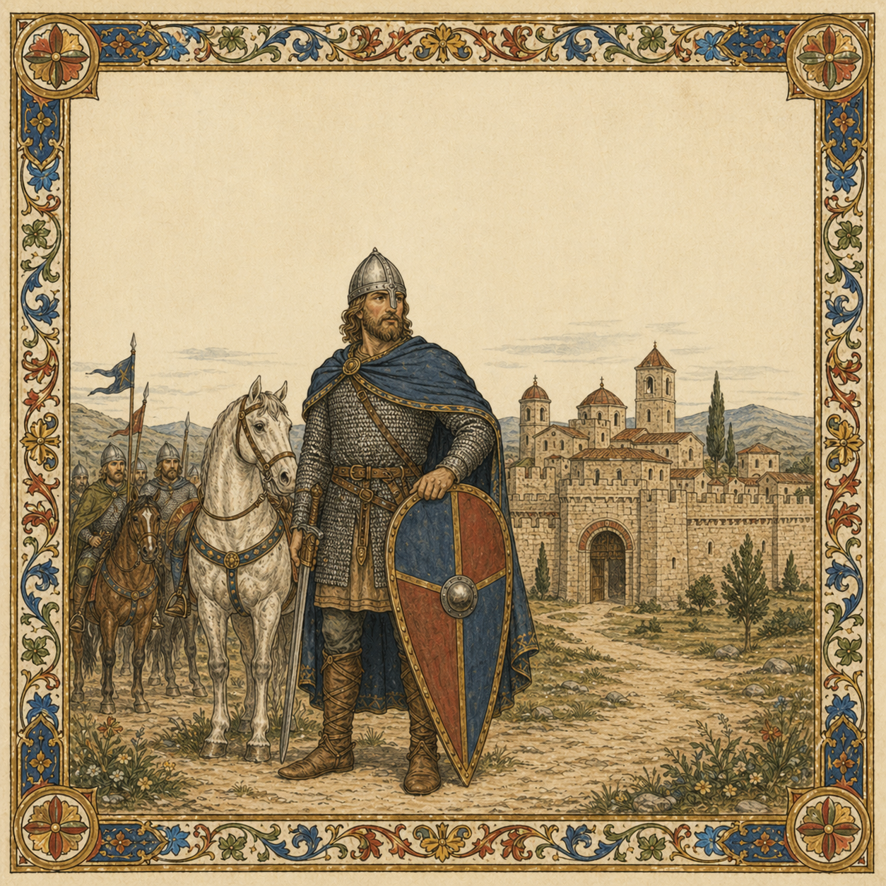

# Aversa

> **Historical context:** After the defeat at Cannae, the surviving Normans drifted through southern Italy as mercenaries. Rainulf Drengot rose from this unsettled world, winning land, status, and the title of Count of Aversa — the first durable Norman foothold in Italy.

[Verse 1]
Cast from the north, from Normandy,
He rode with brothers at his side,
To flee the weight of infamy,
And there let fate become his guide.

[Verse 2]
The Drengot brothers joined the fight,
They pledged to Melus, sowed great strife.
At Cannae they faced greater might,
There Gilbert fell and lost his life.

[Chorus]
A simple sellsword, a proud Norman,
He fought for gold, he fought for more.
No king, no lord — a war-forged man,
To rule a land on foreign shores.
His name remembered evermore,
“Hail, Rainulf — Count of Aversa!”

[Verse 3]
He rose to lead the Norman band,
He rode for hire from lord to lord,
Served Capua, plundered the land,
And swore his only oath to gold.

[Verse 4]
For coin and bride he changed his side,
For Naples he fought Capua.
A fief he gained and rose in pride,
He became lord of Aversa.

[Chorus]
A simple sellsword, a proud Norman,
He fought for gold, he fought for more.
No king, no lord — a war-forged man,
To rule a land on foreign shores.
His name remembered evermore,
“Hail, Rainulf — Count of Aversa!”

[Bridge]
Through blood and gold he forged his name,
Through shifting lords and southern war.
No longer bound to serve for pay,
Now Rainulf ruled from Aversa.

[Final Chorus]
A simple sellsword, a proud Norman,
He fought for gold, he fought for more.
No king, no lord — a war-forged man,
To rule a land on foreign shores.
His name remembered evermore,
“Hail, Rainulf — Count of Aversa!”

[Outro]
“Hail... Rainulf... Count of Aversa...”
