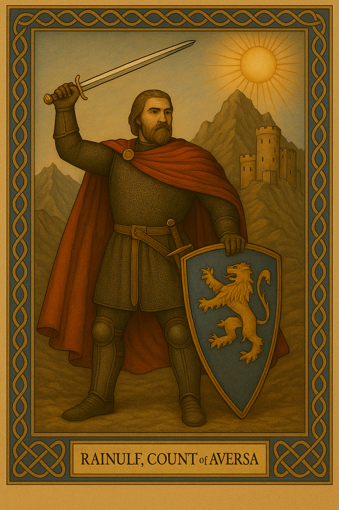

> **Historical Background – Aversa (1030)**
>
> In the years following Cannae, the Normans transitioned from mercenaries to power players. Rainulf Drengot, one of their leaders, was rewarded by the Duke of Naples with a small fief near Capua. This land, Aversa, became the **first Norman-controlled territory** in Italy — a foothold that would grow into a kingdom over the coming decades. Though less renowned than the Hautevilles the Drengots would remain power player in the region. Rainulf's rise attracted more Normans to the region and started a new era.

   
  <em>Rainulf Drengot, Firt Count of Aversa</em>

[Intro – instrumental build]
[Sound: thunder, distant drums, ambient wind swell]

[Verse 1 – mid-tempo, brooding]
Cast from the north, from Normandy  
He traveled far for redemption  
With his brothers and companions  
To forge his path, his destiny  

[Verse 2 – marching rhythm, rising tension]
The Drengot brothers sought the fight  
They rode with Melus to Cannae’s field  
Through victory and through defeat  
They fought for who would pay the price  

[Chorus – chant-like, bold, layered]
A simple sellssword, a proud Norman  
He fought for gold, he fought for more  
No king, no lord — a war-forged man  
To rule a land on foreign shores  
His legend written forever  
“Hail, Rainulf — Count of Aversa!”

[Verse 3 – confident, battle-worn]
He fought for coin but wanted more  
He fought for patrons, dukes and lords  
Was granted gold, domain, and wife  
Rose a count from a sellssword’s life  

[Verse 4 – darker, triumphant tone]
A Norman lord in Lombard land  
He fought, betrayed and knew the game  
To always rise and feel no shame  
His fortune made by his own hand  

[Chorus – repeated, add backing vocals]
A simple sellssword, a proud Norman  
He fought for gold, he fought for more  
No king, no lord — a war-forged man  
To rule a land on foreign shores  
His legend written forever  
“Hail, Rainulf — Count of Aversa!”

[Bridge – slow, spoken or half-sung over ambient guitar]
He watched his brothers bleed and break  
Then pledged his sword for power’s sake  
His patrons crowned him with deceit  
Yet still he rose — and took their seat  

[Final Chorus – faster, triumphant, chant energy]
A simple sellssword, a proud Norman  
He fought for gold, he fought for more  
No king, no lord — a war-forged man  
To rule a land on foreign shores  
His legend written forever  
“Hail, Rainulf — Count of Aversa!”

[Outro – fading, echoing]
“Hail... Rainulf... Count of Aversa...”  
[Sound: fading drums, distant thunder, boots in mud]

April 22, 2025 at 8:11 PM - Jeremie Hugues
