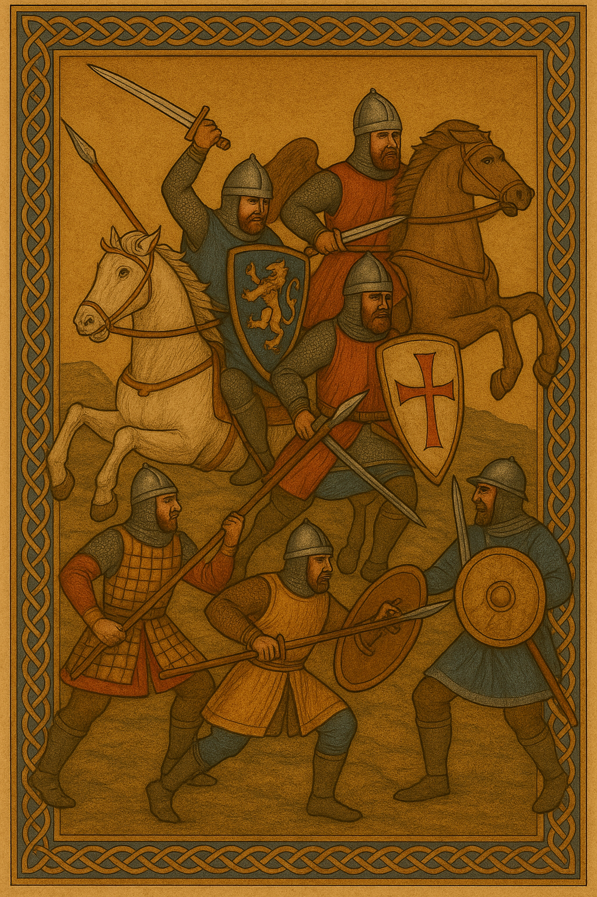

> **Historical Background – Cannae (1018)**
>
> After initial success, Melus and his Norman allies were met with a crushing response from the Byzantines. At the Battle of Cannae in 1018 — near the same site where Hannibal once defeated the Romans — the rebel forces were decimated. The defeat was devastating, but the ferocity of the Norman warriors left a lasting impression on the region’s rulers. Gilbert Buatère, one of the Drengot brothers and leader of the Normans, would die in this battle. Far from ending the Norman invasion, the battle would prove a mere reprieve. Bari would remain under Imperial control until 1071 and would be the last imperial bastion to fall in Italy.

   
  <em>Second Battle of Cannae, 1018</em>

[style: epic female-fronted metal, cinematic, slow tempo]
[vocals: female, clean, expressive, high diction clarity (Evanescence style)]
[tempo: slow and deliberate throughout]

[intro: very slow tempo, spoken over ambient pads, soft piano, distant drums]
[spoken]
Who dares defy an Empire,  
Must face the greatest might on earth,  
Hannibal’s deeds may inspire,  
Yet Cannae is a place of death  

[verse: piano, clean guitar swells, cello, tom hits]
When Melus, prince of Lombard pride  
Called Norman blades to fight beside  
On sacred ground an oath was sworn  
A strong alliance then was born  
They took to battle side by side,  
Ravaged Apulia far and wide  

[chorus: full band enters slowly, strings + distorted guitar + ambient pads]
And there they fell, on Cannae’s field  
They rose, they fought, and did not yield  
The Norman charge broken and crushed  
The Empire’s will restored

[verse: slow drive, ambient distortion, emphasis on vocal presence]
Basil, fierce catapan, raised a host  
To reclaim the land he had lost  
For battle, two mighty forces  
They clashed on Otranto’s shores  
The Normans' charge was fierce and brave  
Varangians would be their grave

[chorus: repeat with rising string swells, double vocals/harmonies]
And there they fell, on Cannae’s field  
They rose, they fought, and did not yield  
The Norman charge broken and crushed  
The Empire’s will restored

[verse: darker tone, slower rhythm, layered instrumentation]
The Lombards’ hopes were swept away  
And with their lives they had to pay  
Norman pride and bravery  
Met great Varangian fury  
The Empire struck back with might  
And restored imperial right  

[bridge: very slow, spoken over ambient synth + piano only]
[spoken]
A battle lost, a great defeat  
The rebels forced into retreat  
The catapan stood proud that day  
Still fate would have the final say  

[chorus: final burst of energy, orchestral metal intensity, slow but powerful]
And there they fell, on Cannae’s field  
They rose, they fought, and did not yield  
The Norman charge broken and crushed  
The Empire’s will restored

[outro: spoken, very slow, fading strings and bells]
[spoken]
The Normans were routed and slain  
Their banners torn, not in vain  
More would ride south with bold intent  
And with their wars cause great lament  

[ghost chorus: whispered or softly sung, over ambient pads or single piano line]
And there they fell, on Cannae’s field  
They rose, they fought, and did not yield  
The Norman charge broken and crushed  
The Empire’s will restored  

April 22, 2025 at 8:36 PM - Jeremie Hugues
